# Hall Booking Management System

## Technology Stack
- **Integrated Development Environment (IDE):** Visual Studio 2022 Community Edition
- **Programming Language:** C#
- **Database Management System:** SQL Express 2022
- **Reporting Tool:** Crystal Reports For VS2022

## Introduction
The **Hall Booking Management System** is a desktop application designed to manage the booking and scheduling of halls for various events and functions. The system aims to simplify the process of managing hall reservations, tracking availability, and generating reports, ensuring efficient and effective operations.

## Objectives
- Streamline the booking process for halls.
- Provide a user-friendly interface for managing hall availability and reservations.
- Maintain an organized record of all bookings and client details.
- Generate detailed reports for analysis and management purposes.

## Features
### 1. User Authentication and Authorization
- Secure login for administrators and staff.
- Role-based access control to ensure data security.

### 2. Hall Management
- Add hall details.
- View hall availability on a selected date.

### 3. Booking Management
- Create, update, and cancel bookings.
- Search and filter bookings based on various criteria (date, hall, client name).

### 4. Client Management
- Maintain a database of clients with contact information.
- View client booking history.

### 5. Payment Management
- Record payment details for bookings.
- Generate invoices and receipts.

### 6. Reporting
- Generate customizable reports using Crystal Reports.
- Export reports to various formats (PDF, Excel).

## Database Design
The database consists of the following tables:
- **Users:** Stores user credentials and roles.
- **Halls:** Stores details of the hall.
- **Bookings:** Stores booking information, including date, time, hall, and client details.
- **Clients:** Stores client information.
- **Payments:** Stores payment details associated with bookings.

## Crystal Reports Integration
Crystal Reports is integrated to provide robust reporting capabilities. Users can generate various reports, such as:
- Booking summaries
- Financial reports
- Client activity logs

## Conclusion
The **Hall Booking Management System** provides a comprehensive solution for managing hall reservations efficiently. By leveraging **Visual Studio 2022, C#, SQL Express 2022, and Crystal Reports**, the system ensures a robust and scalable platform for hall booking management.

## Screenshots
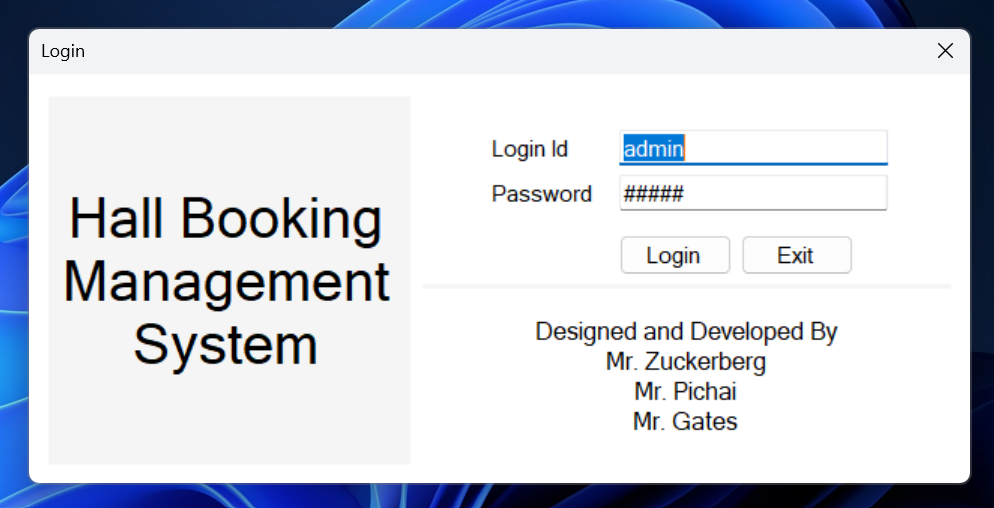
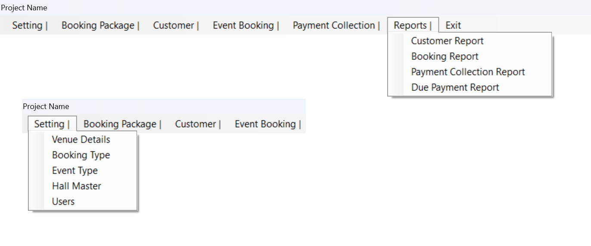
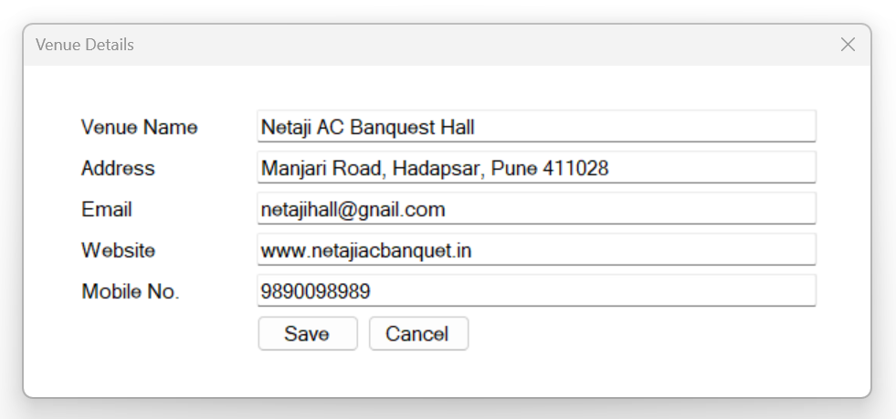
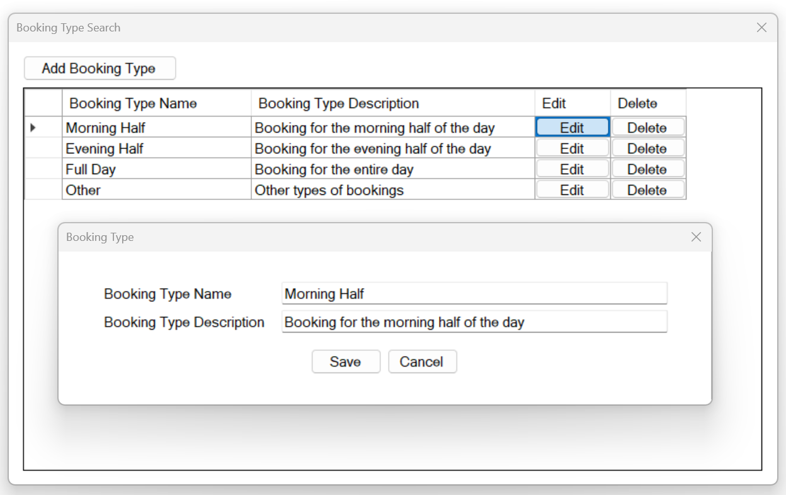
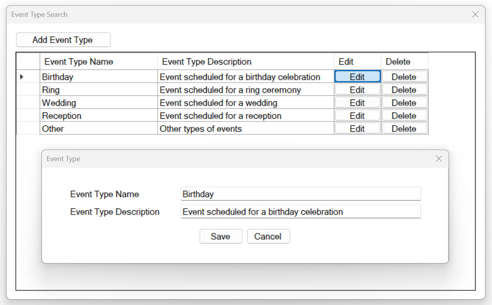
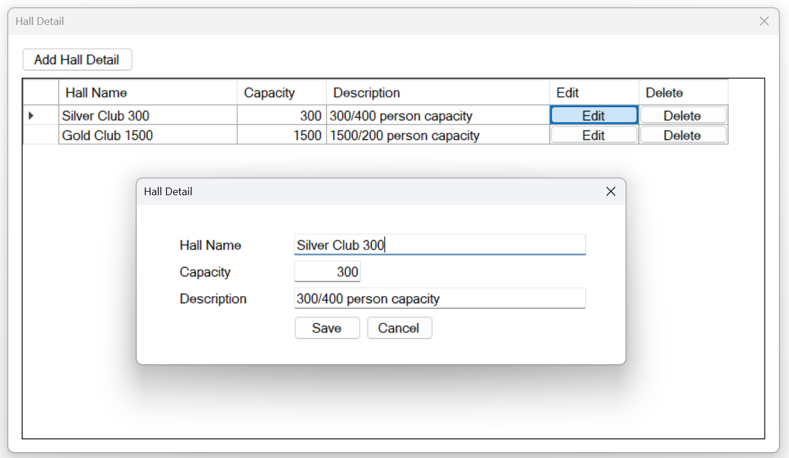
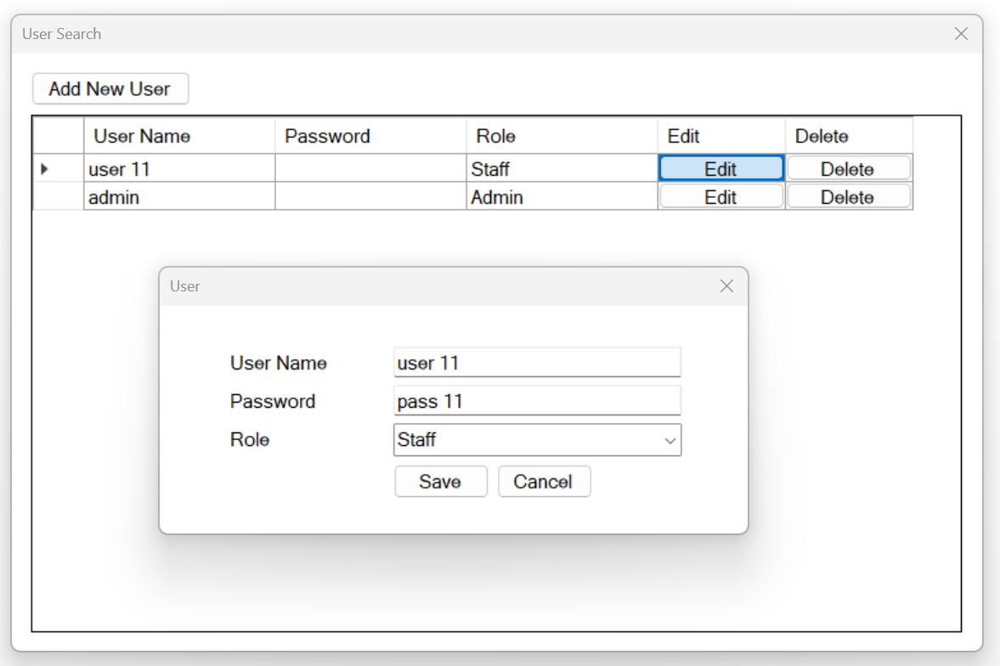
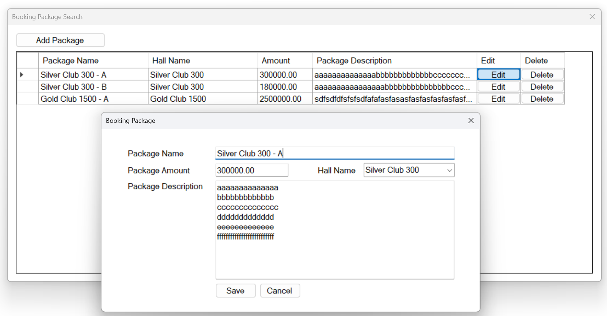
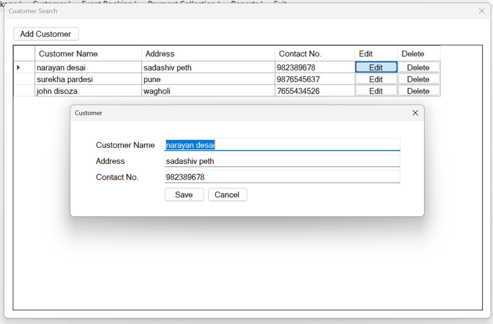
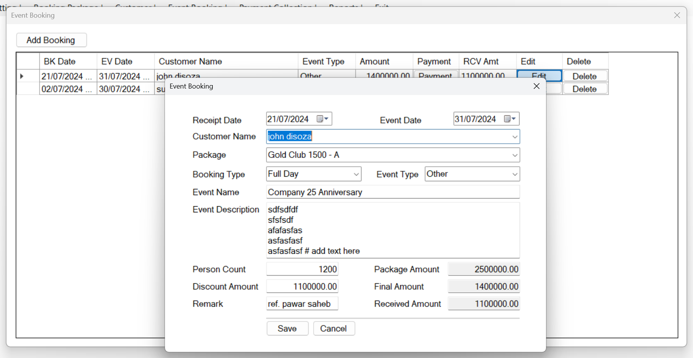
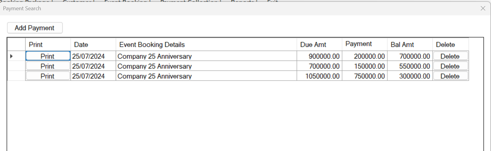
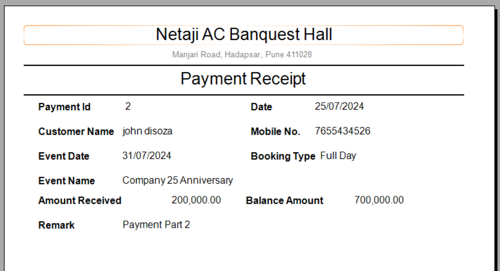

# Apply For 

### Online C# Project Workshop For College Students
https://wa.me/p/8685551258164102/919765975757

### Free Project Guidance For College Students
https://wa.me/p/7965729696887851/919765975757

### Free Online Internship
https://wa.me/p/8277870308947674/919765975757
